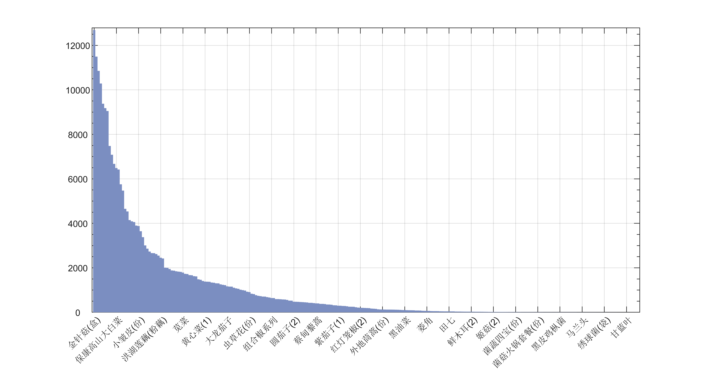
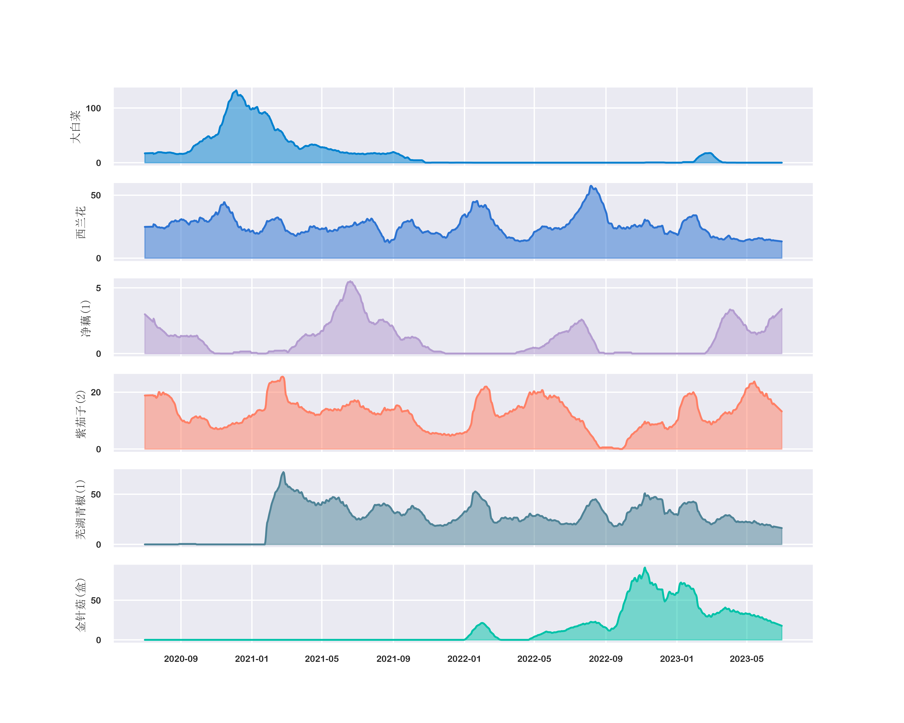
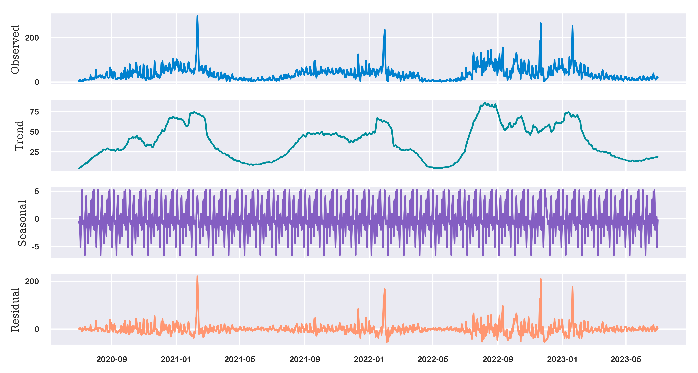
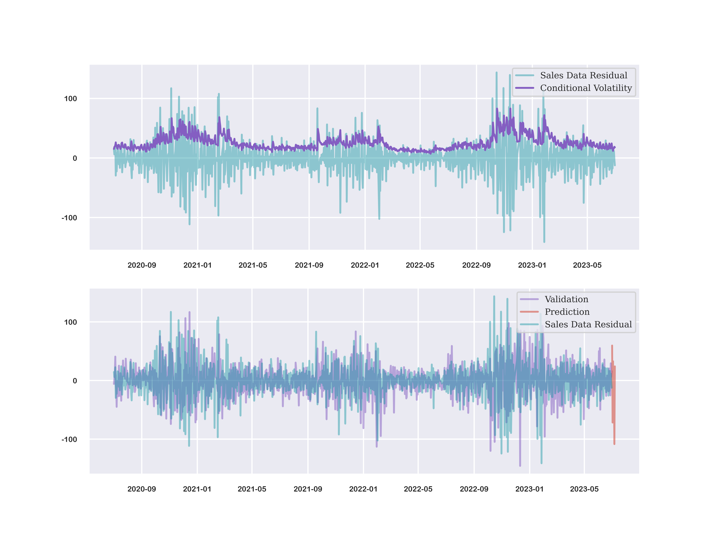
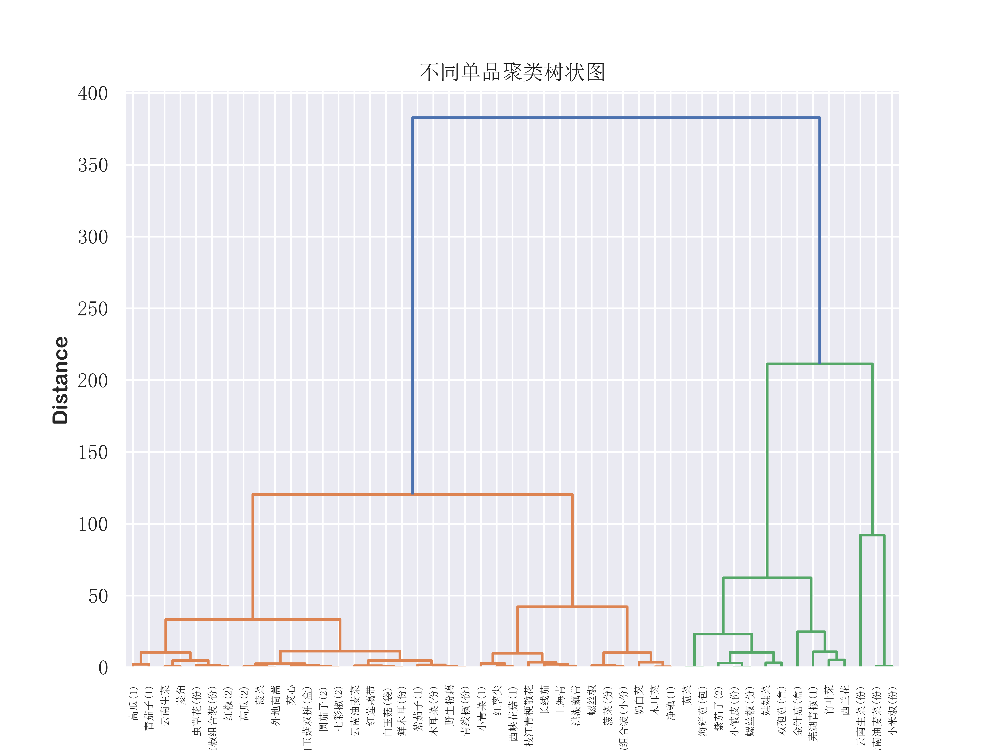
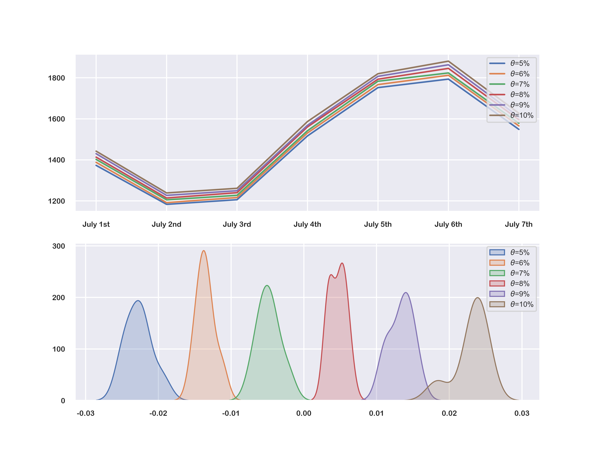

## Introduction

This is an excellent paper of mathematical modeling research with the honour of **_National Second Prize (<1.53%)_**.

+ **Research on Replenishment and Pricing Strategies Based on Time Series Linkage Analysis**
  **Zhihao Li**, Pai Lin, Kaida Huang
  _China Undergraduate Mathematical Contest in Modeling (CUMCM), 2023_
  [[paper](https://github.com/LZHMS/TSLA/blob/master/paper.pdf)][[code](https://github.com/LZHMS/TSLA)]

## Research Background


## Project Started
1. Clone `TLSA`
```git
git clone https://github.com/LZHMS/TSLA.git
```
2. Configure the environment of `Jupyter Notebook`

## Project Structure
+ The codes of `P1.ipynb` mainly focus on the big data processing of the paper and you can easily run the codes to get the results. Also I have uploaded the all processed data files under the `data` folder.
+ The codes of `P2-P3.ipynb` mainly focus on the mathematical modeling of the paper. Especailly, how this model can be used to predict the future saling patterns of vegetable prices and varieties in order to develop the best ordering strategy.

## Project Results
First, we explored the sales distribution of various vegetable categories, as shown in the following figure, which exhibits significant differences in distribution:


Next, we studied the temporal distribution of sales for various vegetable categories. The sales distribution over the three years shows seasonal differences, indicating that different vegetable categories often have different sales cycles, as illustrated in the following figure:

Furthermore, we further decomposed the sales data of all vegetable categories into seasonal components, extracting trend components and seasonal variations.


Afterwards, we utilized the TLSA model to forecast the sales of vegetable categories and compared the forecasted results with actual sales data. The results are illustrated in the following figure:


To understand the complementary and substitutive relationships among vegetable categories, we introduced a clustering model to conduct cluster analysis on all individual vegetables. This allows us to clearly identify the categories of each vegetable item, aiding in further formulation of procurement strategies.


Finally, based on the model's prediction results, we proposed an optimal vegetable category ordering strategy. This strategy aims to maximize the complementary and substitutive relationships among vegetable categories while minimizing competition between them, thus achieving balance among vegetable categories. The sensitivity of the model to various adjustment parameters can be observed in the following figure, demonstrating the model's robustness.


## My Paper
<iframe src="/pdfjs/web/viewer.html?file=/pdf/publications/TLSA.pdf" style='width:100%;height:800px'></iframe>

## Contributors

+ [Zhihao Li](https://lzhms.github.io/)
+ Pai Lin
+ Kaida Huang
